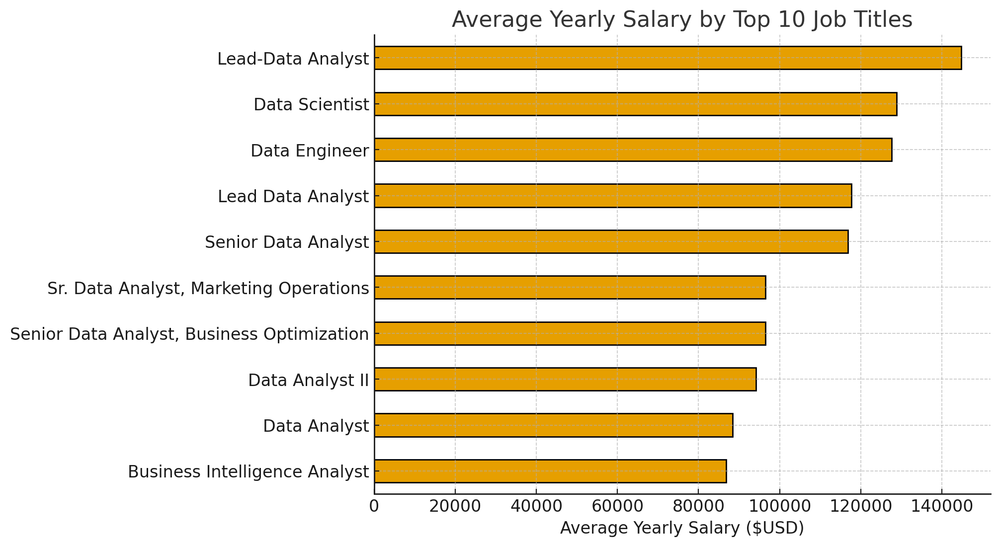

# ChatGPT Salary Analysis Project

## Table of Contents

1. [Introduction](#introduction)  
2. [Dataset Description](#dataset-description)  
3. [Data Cleaning and Preprocessing](#data-cleaning-and-preprocessing)  
4. [Exploratory Data Analysis](#exploratory-data-analysis)  
5. [Machine Learning Model](#machine-learning-model)  
6. [Model Results and Visualizations](#model-results-and-visualizations)  
7. [Conclusion and Future Work](#conclusion-and-future-work)  

## Introduction

The **ChatGPT Salary Analysis Project** explores job postings data to uncover insights about salaries across different job titles, platforms, and locations. 

The project combines **Exploratory Data Analysis (EDA)** and **Machine Learning** to understand salary distributions, detect trends in the job market, and build a predictive model for yearly salaries.  

## Dataset Description

The dataset contains job postings data with **27 columns** and thousands of rows, covering information about job titles, companies, locations, salaries, and platforms.  

The dataset is stored in the repository under [csv/gsearch_jobs.csv](csv/gsearch_jobs.csv).

## Data Cleaning and Preprocessing

Several steps were applied to clean and prepare the dataset before analysis and modeling.  

Data wrangling was done primarily with **Pandas** and **NumPy**.  

1. **Handling Missing Values**  
   - Removed rows with missing target values (`salary_yearly`).  
   - Dropped or imputed missing values for other salary-related fields as needed.  

2. **String Normalization**  
   - Stripped unnecessary spaces in the `location` column.  
   - Cleaned the `via` column by removing the word *"via"* from values and renamed it to **job_platform**.  

3. **Feature Engineering**  
   - Standardized salary values into a single yearly salary (`salary_yearly`).  
   - Extracted minimum (`salary_min`), maximum (`salary_max`), hourly (`salary_hourly`), and average (`salary_avg`) salary fields when available.  

4. **Tokenization**  
   - Created `description_tokens` for text-based exploration of job descriptions.  

*These preprocessing steps ensured the dataset was consistent, reduced redundancy, and made it suitable for **Exploratory Data Analysis (EDA)** and machine learning tasks.*  

## Exploratory Data Analysis

Exploratory Data Analysis (EDA) was conducted to understand the structure of the dataset and extract insights.

Visualizations were created using **Matplotlib** and **Seaborn**. 
 
The **full set of charts** can be found in [images/EDA](images/EDA) (EDA visuals) and [images/ML](images/ML) (model visuals).  

Below are selected highlights:

1. **Categorical Variables**  
   - Identified the **Top 10 Job Platforms**.  

          

        **Insights**:  
        - LinkedIn dominates as the leading job posting source.  
        - BeBee and Upwork also account for a large share of postings.  
        - Smaller platforms contribute less volume but are still represented.  

2. **Numeric Variables**  
   - Examined salary-related fields with histograms.  
   - Example: Distribution of yearly salaries.  

          

        **Insights**:  
        - Salaries are heavily skewed toward lower ranges.  
        - Very high salary postings are relatively rare.  
        - Most postings cluster within the lower-to-mid salary brackets.  

3. **Cross Analysis**  
   - Compared average yearly salaries across the most common job platforms, job titles, and job locations.  

          

        **Insights**:  
        - Smaller niche platforms report higher average salaries.  
        - LinkedIn shows lower averages despite being dominant in posting volume.  
        - Salary variation by platform suggests audience and industry targeting.  

          

        **Insights**:  
        - Senior roles tend to command higher salaries.  
        - Generalist roles such as Data Analyst fall on the lower end.  
        - Specialized roles like Data Scientist have strong earning potential.  

          

        **Insights**:  
        - Salaries vary significantly across locations.  
        - Some hubs consistently offer above-average pay.  
        - Geographic location is a key driver of compensation levels.  

*The insights from EDA guided the choice of features used in the machine learning model.*  

## Machine Learning Model

To predict yearly salaries, a **Random Forest Regressor** was implemented as the baseline model.  

### Model Setup
- **Inputs (Features):**  
  - Job Title  
  - Job Platform  
  - Job Location  

- **Target (Label):**  
  - Yearly Salary (`salary_yearly`)  

- **Preprocessing:**  
  - Applied one-hot encoding to categorical features (`title`, `job_platform`, `location`).  
  - Split dataset into training (80%) and testing (20%).  

- **Modeling:**  
   - Used **Scikit-learn**’s `RandomForestRegressor` with 100 trees (default hyperparameters unless stated otherwise).  
   - Wrapped preprocessing and modeling steps into a unified pipeline.  

### Evaluation Metrics
- **Root Mean Squared Error (RMSE):** ~30,887 ($USD)  
  - This means the model’s predictions are off by about **$31k on average** compared to the actual yearly salary of a job posting.  

- **R² Score:** ~0.28  
  - This means the model explains only about **28% of the variation** in salaries across job postings.  
  - The remaining 72% is unexplained, suggesting that other important features (like detailed job descriptions, company size, or industry) are not captured in this baseline model.   

### Insights
- The model captures some variation in salaries but leaves a significant amount unexplained.  
- Performance suggests that categorical job metadata alone is not enough for precise salary prediction.  
- Incorporating additional features (e.g., job description text embeddings, company size, industry) could improve accuracy.  

*The following section visualizes the model’s performance.* 

## Model Results and Visualizations

The Random Forest model was evaluated on the test dataset.  

### Visualizations

1. **Predicted vs Actual Salaries ($USD)**  
   - A scatter plot comparing predicted salaries with actual values. 

        

      **Insights**:  
      - Model consistently underestimates salaries at the high end.  
      - Predictions cluster around mid-range values, showing limited sensitivity to extremes.  
      - Indicates bias toward average salaries and limited explanatory power of the baseline model.  

2. **Predicted Salaries by Platform ($USD)**  
   - Comparison of predicted salaries for *Data Analyst* across different platforms.  

        

      **Insights**:  
      - Relative differences between platforms are captured (LinkedIn slightly higher than smaller sites).  
      - Overall prediction accuracy is low, with narrow ranges across platforms.  
      - Highlights that richer feature sets are needed to separate platform-level salary effects.  

*These visualizations confirm the limitations of the baseline model and highlight directions for improvement.*  
  
## Conclusion and Future Work

This project demonstrated how job posting data can be used to analyze salary trends and build predictive models.  

### Key Takeaways
- **EDA** revealed clear trends in job platforms, titles, and locations, as well as skewed salary distributions.  
- The **Random Forest baseline model** achieved limited accuracy (RMSE ~30k, R² ~0.28), showing that categorical job metadata alone does not fully explain salary variation.  
- Visualizations highlighted systematic biases in predictions, such as underestimation of higher salaries.  

### Future Work
- **Feature Expansion:** Incorporate job description text embeddings, company attributes, and industry classifications.  
- **Advanced Modeling:** Experiment with Gradient Boosting (XGBoost, LightGBM, CatBoost) and deep learning models.  
- **Geographic Analysis:** Normalize salaries with cost-of-living indices to uncover regional adjustments.  
- **Deployment:** Build an interactive dashboard or API for real-time salary prediction.  

This work provides a foundation for more robust salary prediction tools while also offering exploratory insights into the job market. Future extensions can transform this analysis into a practical salary prediction tool for job seekers and employers.  

 

